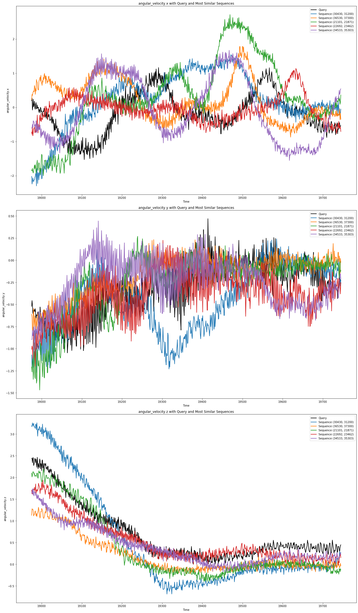
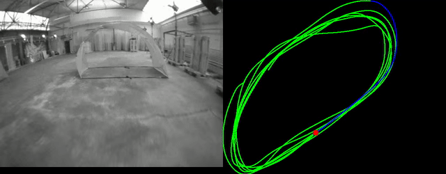
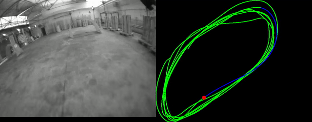

# What is robologs-timeseries-utils
A collection of timeseries utility functions to analyze, search and transform robotic sensor data. 

# Quickstart

## Try the Timeseries Similarity Search Jupyter Notebook 

****

### Context

Our Timeseries Similarty Search notebook demonstrates how to perform a multi-signal timeseries similarity search in a rosbag.
 
### Goal

Find the most similar looking subsequences for a query signal in a given IMU signal. 

### Steps
- Extract IMU and image data from a rosbag using [robologs-ros-utils](https://github.com/roboto-ai/robologs-ros-utils)
- Plot IMU angular velocities (angular_velocity.x, angular_velocity.y, angular_velocity.z)
- Select a region of interest in the IMU plot as a query signal, show corresponding video sequence
- Search for the n-most similar subsequences in the IMU plot
- Visualize the n-most similar subsequences against the query signal
- Show video of n-most similar subsequences

### Data

The drone racing dataset used in this notebook was recorded by the Robotics and Perception Group (RPG) at the University at Zurich and can be found [here](https://fpv.ifi.uzh.ch/datasets/). It is released under the [Creative Commons license (CC BY-NC-SA 3.0)](https://creativecommons.org/licenses/by-nc-sa/3.0/), which is free for non-commercial use (including research).

### Example

IMU plot with query signal (black) and 5-most similar subsequences.



**Query Sequence**



**Most Similar Subsequence**




### Install Jupyter

```bash
pip3 install jupyter
jupyter notebook
```

### Run Timeseries Similarity Search Notebook

```bash
cd ~/Code/robologs-timeseries-utils/
jupyter notebook notebooks/TimeseriesSimilaritySearch.ipynb
```


